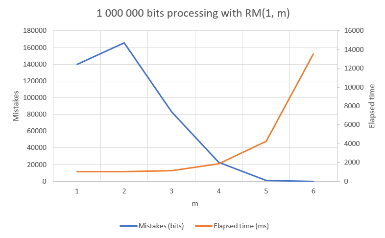

# VU Coding Theory

Implemented task A5: Reed-Muller code RM(1,m) using Fast Hadamard Transform for decoding.

This is a React [SPA](https://en.wikipedia.org/wiki/Single-page_application) (JavaScript that runs only on the client side – the browser). Implementation was done in [TypeScript](https://www.typescriptlang.org/) (TS) and [Vite](https://vitejs.dev/) build tools.

### Task parts

- [x] Matrix operations (multiplication, Kronecker product, identity matrix)
- [x] Encoding
- [x] Channel
- [x] Decoding
- [x] All 3 scenarios: raw, text, image

### Libraries

All 3rd party libraries can be seen in [package.json](./package.json):

- `@chakra*`, `@emotion*`, `framer-motion` – UI component related
- `bmp-js` – used to retrieve the BMP file header
- `buffer` – used to help reading files
- `react*` – front end library
- `@types/*`, `ts-node`, `typescript` – TS related packages
- `eslint*`, `prettier` – linting and code formatting
- `fast-check`, `jest`, `ts-jest` – testing
- `vite` – build tool

Apart from those, I've also used some built in functions, mainly:

- `Math`'s `floor`, `random`, `pow`, `ceil`, `abs` – trivial math functions

### How to run

Since this is an SPA, the build output of this application is static HTML/CSS/JS files. Furthermore, this is built using [Node.js](https://nodejs.org/en) (it provides you the `npm` command).

To generate the build, you can run: `npm run build`. Build output will be present in `dist/` directory, so you can use your favorite web server (e. g. nginx, caddy) to serve it locally.

I have set up a web server for you: [https://benasb.github.io/vu-coding/](https://benasb.github.io/vu-coding/)

To run the development build, you can run: `npm run dev`

### Source code structure

The source files are located in the [src/](./src/) directory. It follows a simple structure:

- `components/` contains React UI components
- `logic/` contains the coding theory part. From a mathematics standpoint, this is were you should look into.
  - `decoding/` contains files related to decoding
  - `encoding/` contains files related to encoding
  - `math/` contains files related to general math (mainly matrices)
- `state/` contains logic around state management in React
- `utils/` contains helpers (mainly type conversions)

Plain TypeScript (logic) files have a `.ts` extension, UI components have a `.tsx` extension and `.spec.ts` files are tests.

### UI

The UI is fairly simple:

- At the top, you can enter parameters for the code and the channel.
  - Be careful when entering the `m` parameter, as high values result in big matrices and long encoded words, you might run into memory/performance issues.
- Tabs. These represent the 3 required scenarios. Click on either one of the tabs.
  - Raw. This tab let's the user type in a "raw" binary string of 1s and 0s. Just start typing into the `v` field. The `y` field is editable, as required by the task. All of the labels have tooltips, so hover on them to know what that value is.
  - Text. This tab let's you enter text into the `Input` field and presents you the uncoded and coded outputs. These input fields are text areas, so multiple lines are supported, as required by the task.
  - Image. This tab allows you to upload a `.bmp` image and presents you the uncoded and coded images after passing through a channel. Be careful when uploading large bmp files, as they may take quite a while to load, encode, decode and present.

All of the fields have validation and will give you some kind of feedback if something is wrong.

You can always start over by refreshign the page.

### Programming decisions

- A sequence of 1s and 0s (e. g. the one you enter in manually in Raw tab) is held as a `BinaryString` type (which is just a `string` under the hood). Various type convertion functions are present in [`src/utils/type-utils.ts`](./src/utils/type-utils.ts)
- Before splitting the vector into chunks of required length (for my code this is `m+1`), in text and image tabs, they are padded with 0s at the end and then after decoding this padding is removed. The number of padded 0s is not distorted through the channel.
- Since strings in JS by default are [16 bit length](https://stackoverflow.com/a/11141331/13135665), I treat all characters as length 16 (padding the start with 0s if needed). JS allows you to "return the Unicode value of the character" so that is used and converted into a binary representation. A reverse procedure is done when converting from 1s and 0s to text.
- File reading is not as straightforward in this scenario, since the application runs in the user's browser and not directly on the operating system, so the [FileReader](https://developer.mozilla.org/en-US/docs/Web/API/FileReader) API alongside an `<input type="file" />` is used (as you can't just read a file from the computer's file system).
- Most logic functions have unit tests, which helped immensely when developing, so you can refer to those for better understanding of what a certain functions does. I also figured that we can utilize [property testing](https://en.wikipedia.org/wiki/Property_testing), since (without a distortion on the channel) what got encoded, must match what was decoded, so there's a test in [`src/logic/rm.spec.ts`](./src/logic/rm.spec.ts) that generates `m` and `input` binary strings to check if this property holds. Around 200 combinations are performed.
- Generation and control matrices get generated immediately when `m` changes.

### Experiment

I chose to analyze the behaviour of the RM(1, m) code for different m values in terms of mistakes made and elapsed time.

#### Values

- `m` will be go over the range `[1, 6]`
- `pe` (channel distortion probablity) is `0.1`
- The input is a randomly generated binary string of `1000000` bits. This string is hardcoded into the experiment and the same for all tests.
- For each `m`, the test will be performed 10 times and an average of the test results will be taken.

#### Definitions

- Mistake – a single bit difference between the input and the decoded output. To count the mistakes, you just go over all of the bits (from 1 to 1000000) and compare the bits at that position. If the values do not match, you count a mistake.
- Elapsed time – the elapsed time (in milliseconds) covering generation matrix and control matrices preparation, encoding, passing through the channel and decoding. Counting of mistakes is not in scope of this time.

#### Performing

You can run `npm run experiment`. The average values over the tests will be printed out in the console.

#### Results

| m   | Mistakes (bits) | Elapsed time (ms) |
| --- | --------------- | ----------------- |
| 1   | 140029.3        | 1011              |
| 2   | 165364.6        | 997.4             |
| 3   | 82895.5         | 1119.1            |
| 4   | 22498.1         | 1827.9            |
| 5   | 794.5           | 4261.1            |
| 6   | 0.9             | 13492.5           |

This can be visualized with a graph (as requested in the task)

#### Conclusion

Bigger values of `m` for the code RM(1,m) lead to less mistakes made but more elapsed time. Based on theory, apart from time, we can also tell that this also has a drawback for space efficiency, since the matrices become large and encoded words become lenghtier.

Interesting insight between `m = 1` and `m = 2`. The second one on average has more mistakes that the first one. This can probably be explained that the coded words on the second one are longer, hence there is more "space" for distortions to occur and the coded word is not yet big enough to correct those mistakes.

### References

- [[HLL91, §3.8–3.9, p. 89–95]](https://klevas.mif.vu.lt/~skersys/doc/ktkt/literatura13.pdf)
- [React API reference](https://react.dev/reference/react)
